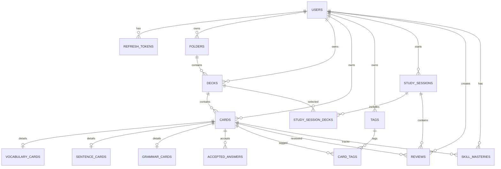

# Data Model, API Contract & Traceability

## 1. Mục tiêu

File này là contract kết nối:

```text
Requirement
    ↓
UX
    ↓
API
    ↓
Backend Module
    ↓
Database
```

Không để code phải suy đoán data/API behavior từ `project_overview.md`.

---

# 2. MVP Data Model

## 2.1 MVP Tables

```text
users
refresh_tokens

folders
decks

cards
vocabulary_cards
sentence_cards
grammar_cards

accepted_answers

tags
card_tags

study_sessions
study_session_decks

reviews
skill_masteries
```

## 2.2 Deferred Tables

```text
media
review_schedules
sync_changes
grammar_examples (nếu MVP chưa cần cấu trúc riêng)
cloze_exercises
offline queue tables
```

---

# 3. ERD



---

# 4. Core Entity Contracts

## users

```text
id
email
password_hash
display_name
created_at
updated_at
```

Constraints:
- email unique.
- password hash only.

## refresh_tokens

Suggested fields:

```text
id
user_id
token_hash
expires_at
revoked_at
created_at
```

> Exact refresh strategy requires human decision (OD-001). These suggested fields do not approve token granularity, lifetime, rotation or revocation semantics.

## folders

```text
id
user_id
name
position
created_at
updated_at
```

## decks

```text
id
user_id
folder_id nullable
name
description nullable
position
created_at
updated_at
```

## cards

```text
id
user_id
deck_id
type
created_at
updated_at
deleted_at nullable
```

MVP type:
- VOCABULARY
- SENTENCE
- GRAMMAR

KANJI reserved for later unless scope changes.

## vocabulary_cards

```text
card_id PK/FK
japanese
reading nullable
meaning
sino_vietnamese nullable
word_type nullable
jlpt_level nullable
notes nullable
```

## sentence_cards

```text
card_id PK/FK
japanese
reading nullable
meaning
notes nullable
```

## grammar_cards

```text
card_id PK/FK
pattern
meaning
structure nullable
explanation nullable
notes nullable
```

## accepted_answers

```text
id
card_id
exercise_type
answer
normalized_answer
created_at
```

## tags

```text
id
user_id
name
created_at
```

Recommended:
- unique `(user_id, normalized_name)` nếu team muốn tránh tag trùng.

## card_tags

```text
card_id
tag_id
```

Unique:
- `(card_id, tag_id)`.

## study_sessions

```text
id
user_id
started_at
finished_at nullable
exercise_types
total_questions
correct_count
wrong_count
duration_ms nullable
settings_json
```

## study_session_decks

```text
study_session_id
deck_id
```

## reviews

```text
id
user_id
card_id
study_session_id
exercise_type
skill
question_snapshot nullable
user_answer
correct_answer
is_correct
first_try_correct
attempt_count
response_duration_ms nullable
user_override
reviewed_at
```

Historical semantics:
- không update tùy tiện,
- không cascade delete một cách làm mất history nếu Card bị xóa logic.

## skill_masteries

```text
id
user_id
card_id
skill
mastery_score
correct_count
wrong_count
first_try_correct_count
correct_streak
wrong_streak
last_reviewed_at
updated_at
```

Unique:

```text
(user_id, card_id, skill)
```

Full SRS fields (`next_review_at`, `ease`, `interval_days`) có thể thêm ở V1.2 thay vì ép MVP dùng sớm.

---

# 5. Database Invariants

### DB-RULE-001
Mọi Folder/Deck/Card/Tag/StudySession thuộc một User.

### DB-RULE-002
Card owner phải phù hợp với Deck owner.

### DB-RULE-003
Subtype table phải khớp `cards.type`.

### DB-RULE-004
Một Card chỉ có một subtype detail chính.

### DB-RULE-005
Review history không bị overwrite bởi Card edit.

### DB-RULE-006
`skill_masteries` unique theo `(user_id, card_id, skill)`.

### DB-RULE-007
Accepted Answer thuộc Card hợp lệ.

### DB-RULE-008
Cross-user relation bị cấm.

---

# 6. Required Indexes

MVP tối thiểu:

```text
folders(user_id)

decks(user_id)
decks(folder_id)

cards(user_id)
cards(deck_id)
cards(type)

reviews(user_id)
reviews(card_id)
reviews(reviewed_at)

skill_masteries(user_id)
skill_masteries(card_id)

accepted_answers(card_id)

tags(user_id)
```

Có thể thêm composite index sau khi đo query.

---

# 7. REST API Rules

Prefix:

```text
/api/v1
```

## Authentication
Mọi endpoint private dùng authenticated identity.

## Ownership
Backend không nhận `userId` từ client để quyết định owner.

## Validation
DTO validation bắt buộc.

## Error Contract

```json
{
  "statusCode": 400,
  "code": "INVALID_CARD_DATA",
  "message": "Card data is invalid",
  "details": {}
}
```

Frontend xử lý theo `code`, không parse message.

---

# 8. Auth API

## POST `/api/v1/auth/register`

Request:

```json
{
  "email": "user@example.com",
  "password": "********",
  "displayName": "Optional"
}
```

Response shape: team quyết định token trả ngay hay yêu cầu login sau register (OD-011, chưa phê duyệt).

## POST `/api/v1/auth/login`

Request:

```json
{
  "email": "user@example.com",
  "password": "********"
}
```

Illustrative response only; token transport/storage depends on OD-001. This example does not require exposing a refresh token to browser JavaScript:

```json
{
  "accessToken": "...",
  "refreshToken": "...",
  "user": {
    "id": "...",
    "email": "user@example.com",
    "displayName": "..."
  }
}
```

## POST `/api/v1/auth/refresh`

Refresh strategy cần final decision (OD-001):
- token trong body,
- secure cookie,
- platform-specific secure storage.

## POST `/api/v1/auth/logout`

Revokes current refresh/session.

---

# 9. Library API

## Folders

```text
GET    /api/v1/folders
POST   /api/v1/folders
PATCH  /api/v1/folders/:id
DELETE /api/v1/folders/:id
```

## Decks

```text
GET    /api/v1/decks
GET    /api/v1/decks/:id
POST   /api/v1/decks
PATCH  /api/v1/decks/:id
DELETE /api/v1/decks/:id
```

Optional MVP move endpoint or PATCH `folderId`.

---

# 10. Cards API

```text
GET    /api/v1/cards
GET    /api/v1/cards/:id
POST   /api/v1/cards
PATCH  /api/v1/cards/:id
DELETE /api/v1/cards/:id
```

Example create:

```json
{
  "deckId": "deck-id",
  "type": "VOCABULARY",
  "content": {
    "japanese": "食べる",
    "reading": "たべる",
    "meaning": "ăn",
    "jlptLevel": "N5"
  },
  "acceptedAnswers": [
    {
      "exerciseType": "MEANING_TO_JAPANESE",
      "answer": "食べる"
    },
    {
      "exerciseType": "MEANING_TO_JAPANESE",
      "answer": "たべる"
    }
  ],
  "tagIds": []
}
```

### API Decision

Dùng unified card create endpoint hay endpoint theo subtype là OD-003, chưa được phê duyệt và phải khóa trước implementation. Ví dụ bên trên là proposal, không phải quyết định public API.

Khuyến nghị cho MVP:
- unified endpoint ở public API,
- subtype validation ở CardsModule.

---

# 11. Study API

## POST `/api/v1/study-sessions`

Request:

```json
{
  "deckIds": ["..."],
  "questionCount": 20,
  "exerciseTypes": ["TYPING", "MULTIPLE_CHOICE"],
  "shuffle": true,
  "maxAttempts": 3
}
```

Validation:
- deckIds không rỗng,
- Deck thuộc user,
- questionCount hợp lệ,
- exercise types được support.

Response:

```json
{
  "id": "...",
  "status": "ACTIVE",
  "totalQuestions": 20
}
```

## GET `/api/v1/study-sessions/:id`

Trả metadata/session summary.

## GET `/api/v1/study-sessions/:id/next`

Response example:

```json
{
  "exerciseId": "...",
  "type": "TYPING",
  "skill": "PRODUCTION",
  "prompt": {
    "text": "ăn"
  },
  "attempt": 0,
  "maxAttempts": 3
}
```

Không leak correct answer trước thời điểm được phép.

## POST `/api/v1/study-sessions/:id/answers`

Request:

```json
{
  "exerciseId": "...",
  "answer": "食べる",
  "responseDurationMs": 3200
}
```

Retry response:

```json
{
  "status": "RETRY",
  "correct": false,
  "attemptCount": 1,
  "remainingAttempts": 2,
  "revealAnswer": false
}
```

Final correct response:

```json
{
  "status": "COMPLETED",
  "correct": true,
  "firstTryCorrect": false,
  "attemptCount": 2,
  "reviewId": "...",
  "card": {
    "id": "..."
  }
}
```

Final wrong response:

```json
{
  "status": "COMPLETED",
  "correct": false,
  "firstTryCorrect": false,
  "attemptCount": 3,
  "revealAnswer": true,
  "correctAnswer": "食べる",
  "reviewId": "..."
}
```

## POST `/api/v1/study-sessions/:id/finish`

Trả session summary.

---

# 12. Progress API

```text
GET /api/v1/progress/overview
GET /api/v1/progress/difficult
GET /api/v1/progress/cards/:cardId
GET /api/v1/reviews/history
```

`/progress/due` chỉ cần khi SRS scheduling vào scope.

---

# 13. Search API

```text
GET /api/v1/search?q=...&page=1&limit=50
```

Hoặc:

```text
GET /api/v1/cards?q=...&deckId=...&page=1&limit=50
```

OD-010: cần chọn một style và quy tắc normalization rồi dùng nhất quán; cả hai ví dụ vẫn là proposal.

---

# 14. Import API

Đề xuất tách preview và commit:

## POST `/api/v1/imports/preview`

- upload CSV,
- parse,
- return columns/rows/errors/duplicate candidates.

## POST `/api/v1/imports/commit`

- nhận mapping,
- duplicate decisions,
- validated import payload/reference.

Important:
- không commit trước confirmation,
- transaction khi phù hợp.

---

# 15. Pagination

Response list thống nhất:

```json
{
  "items": [],
  "page": 1,
  "limit": 50,
  "total": 120
}
```

Có thể chuyển cursor pagination khi cần, nhưng MVP dùng page/limit là đủ.

---

# 16. Traceability Matrix

| Requirement | UX/Flow | API | Module | Data |
|---|---|---|---|---|
| FR-AUTH-002 | Login | POST `/auth/login` | AuthModule | users, refresh_tokens |
| FR-LIB-001 | Library/Folder | `/folders` | FoldersModule | folders |
| FR-LIB-002 | Folder/Deck | `/decks` | DecksModule | decks |
| FR-CARD-001 | Card Editor | POST `/cards` | CardsModule | cards, vocabulary_cards |
| FR-IMPORT-002 | Import Preview | POST `/imports/preview` | ImportsModule | no final write |
| FR-IMPORT-007 | Import Confirm | POST `/imports/commit` | ImportsModule | cards/subtypes |
| FR-STUDY-001 | Study Setup | POST `/study-sessions` | StudySessionsModule | study_sessions |
| FR-STUDY-005 | Study Session | GET `/study-sessions/:id/next` | ExercisesModule | cards |
| FR-ANS-004 | Typing Flow | POST `/study-sessions/:id/answers` | Exercises/StudySessions | session state/review |
| FR-ANS-005 | Typing Flow | same | Answer Evaluator | no review on empty |
| FR-ANS-007 | Typing Flow | same | Answer Evaluator | reviews |
| FR-REV-001 | Study Flow | answer endpoint | ReviewsModule | reviews |
| FR-REV-002 | History | GET `/reviews/history` | ReviewsModule | reviews |
| FR-MAS-001 | Result/Progress | answer/progress | MasteryModule | skill_masteries |
| NFR-SEC-001 | all private UI | all private endpoints | Auth/guards | user-owned rows |
| NFR-API-001 | error states | all | common exception layer | n/a |

Traceability sẽ được mở rộng khi implementation bắt đầu.

---

# 17. Change Control

Nếu sửa Requirement:

1. Update `PRODUCT_REQUIREMENTS.md`.
2. Tìm Requirement ID trong Traceability Matrix.
3. Review impact:
   - UX,
   - API,
   - module,
   - DB,
   - tests.
4. Update artifact liên quan.
5. Sau đó mới merge code change.

Nếu AI đề xuất thay đổi:
- phải ghi assumption,
- không tự đổi source of truth,
- human approve trước.

---

# 18. Data/API Open Decisions

Canonical status and approval gates: [PROJECT_PLAN.md](../PROJECT_PLAN.md). OD-001 covers refresh/session strategy; OD-002 deletion; OD-003 Card public API; OD-004 Mastery; OD-005 override; OD-006 snapshots; OD-007 exercise persistence; OD-008 flashcard mapping; OD-009 import; OD-010 search; OD-011 register response; OD-013 Grammar examples. These remain unresolved until the relevant approval/feature gate. OD-012 records the already-approved root/subtype storage baseline. A suggested field or example response is not evidence of approval.

# 19. M1 Foundation API

## GET `/api/v1/health`

Public application liveness check. No authentication or user data.

```json
{
  "status": "ok"
}
```

Returns HTTP 200 while the application is serving requests. It does not query the database
on each request. API startup verifies the PostgreSQL connection; `npm run db:check` performs
a separate read-only connection check.

Development documentation: `/api/docs` (Swagger UI), `/api/docs-json` (generated OpenAPI).
Both are disabled outside `NODE_ENV=development`.

Foundation errors retain the section 7 envelope. Global DTO failures use `VALIDATION_ERROR`,
unknown routes use `NOT_FOUND`, and unexpected server failures use `INTERNAL_SERVER_ERROR`
with a generic message and empty details. Validation details include field names and
constraint messages, never submitted values. M1 creates no domain tables or migrations.
