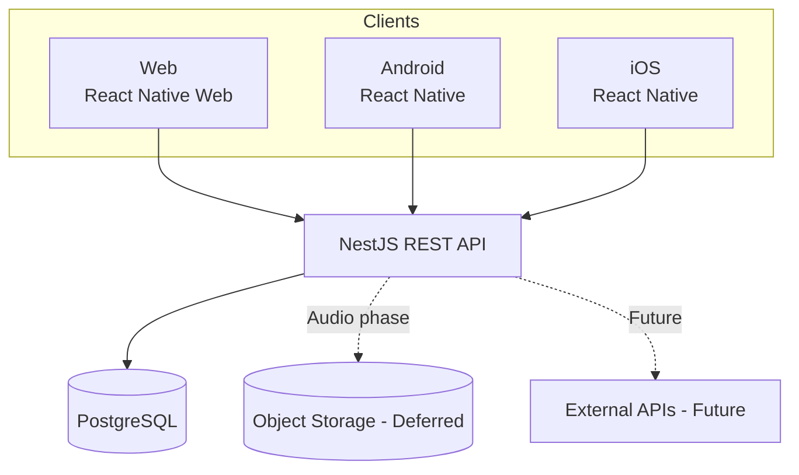
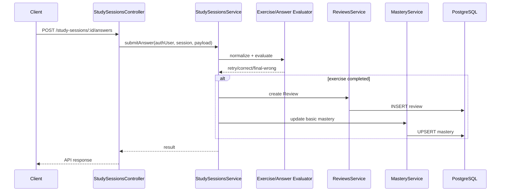

# System Architecture Specification

## 1. Architecture Goals

Kiến trúc phải tối ưu cho:

1. Một codebase client dùng cho Web/Android/iOS ở mức hợp lý.
2. Backend là nguồn xác thực business logic.
3. Review history có tính bền vững.
4. Dễ mở rộng Card types và Exercise types.
5. MVP đơn giản trước; Audio/SRS/Offline thêm sau.
6. Type safety vì FE/BE đều dùng TypeScript.
7. Security boundary rõ ràng.
8. Module có thể test độc lập.

---

# 2. Official Stack

## Client

```text
TypeScript
React Native
Expo
React Native Web
Expo Router
TanStack Query
Zustand
React Hook Form
Zod
```

## Backend

```text
TypeScript
Node.js
NestJS
REST
Swagger / OpenAPI
```

## Database

```text
PostgreSQL
Prisma
```

## Deferred Infrastructure

```text
S3-compatible Object Storage
Expo SQLite
```

chỉ thêm khi Audio/Offline vào scope.

---

# 3. Stack Rationale & Trade-offs

## React Native + Expo + React Native Web

**Why**
- chia sẻ phần lớn business/UI logic,
- phù hợp mục tiêu Web + Android + iOS.

**Trade-off**
- Web UX có thể cần component/layout riêng,
- một số native/web API khác nhau.

## NestJS

**Why**
- module rõ ràng,
- dependency injection,
- DTO/validation,
- Swagger integration,
- phù hợp domain có nhiều business rules.

**Trade-off**
- nhiều boilerplate hơn Express tối giản.

## PostgreSQL

**Why**
- dữ liệu quan hệ rõ:
  User → Folder → Deck → Card → Review/Mastery,
- transaction tốt cho import,
- indexing/search cơ bản đủ cho MVP.

## Prisma

**Why**
- TypeScript-friendly,
- migration workflow,
- relation modeling rõ.

**Trade-off**
- query đặc biệt có thể cần raw SQL hoặc tối ưu riêng.

## REST

**Why**
- đơn giản,
- dễ Swagger,
- phù hợp resource-oriented API hiện tại.

**Trade-off**
- một số màn hình có thể cần nhiều request hơn GraphQL.

---

# 4. High-level Architecture



---

# 5. Client Architecture

```text
Presentation
    ↓
Feature / Application
    ↓
API / Data Access
    ↓
Local Storage
```

## Proposed Structure

```text
apps/client/src/
├── app/
├── components/
├── features/
│   ├── auth/
│   ├── library/
│   ├── cards/
│   ├── import/
│   ├── study/
│   ├── review/
│   ├── progress/
│   ├── search/
│   └── settings/
├── services/
│   ├── api/
│   └── storage/
├── stores/
├── hooks/
├── schemas/
├── types/
├── utils/
└── constants/
```

## Client State Rule

### Server State — TanStack Query
- folders,
- decks,
- cards,
- reviews,
- progress.

### Client State — Zustand
- temporary study UI state,
- local filters,
- UI preferences,
- offline state khi feature đó được triển khai.

Không mirror toàn bộ server data vào Zustand.

---

# 6. Backend Architecture

MVP là **modular monolith**.

```text
apps/api/src/
├── auth/
├── users/
├── folders/
├── decks/
├── cards/
├── tags/
├── imports/
├── exercises/
├── study-sessions/
├── reviews/
├── mastery/
├── search/
├── common/
└── database/
```

Deferred:
- media,
- srs,
- sync,
- kanji,
- exports nâng cao.

---

# 7. Module Responsibilities

## AuthModule
- register,
- login,
- logout,
- refresh.

## UsersModule
- profile/preferences tối thiểu.

## FoldersModule
- folder CRUD.

## DecksModule
- deck CRUD,
- move.

## CardsModule
- root Card,
- subtype data,
- bulk behavior nếu MVP cần.

## TagsModule
- tag CRUD,
- card assignment.

## ImportsModule
- parse,
- preview,
- validate,
- duplicate detect,
- commit import.

## ExercisesModule
- generate Flashcard/Typing/Multiple Choice,
- answer normalization/evaluation strategy.

## StudySessionsModule
- create session,
- select cards,
- next exercise,
- finish session.

## ReviewsModule
- persist historical review,
- history query.

## MasteryModule
- basic mastery update.

## SearchModule
- user-scoped search.

---

# 8. Core Backend Request Flow



---

# 9. Architecture Patterns

## 9.1 Modular Monolith
Dùng trong MVP để tránh complexity microservices.

## 9.2 Layered Boundaries
Controller:
- HTTP only,
- parse/auth/DTO,
- không chứa business algorithm.

Service/Application:
- use case coordination.

Domain/helper:
- normalization,
- exercise generation/evaluation,
- mastery calculations.

Persistence:
- Prisma/database adapter.

## 9.3 Strategy Pattern — Exercise/Evaluation

Mở rộng exercise bằng strategy:

```text
ExerciseGenerator
├── FlashcardGenerator
├── TypingGenerator
└── MultipleChoiceGenerator
```

Answer evaluation có thể tách theo exercise type nếu behavior khác nhau.

## 9.4 Future Strategy Boundary — SRS

MVP chưa implement Full SRS nhưng architecture có thể chừa interface:

```text
ReviewOutcome
    ↓
SchedulingStrategy
    ↓
ScheduleResult
```

Không cần tạo `review_schedules` nếu MVP chưa dùng.

---

# 10. Shared Types

Vì FE/BE cùng TypeScript, có thể dùng monorepo:

```text
apps/
├── client/
└── api/

packages/
├── shared-types/
├── validation/      # chỉ nếu thực sự share được
└── config/
```

### Rule

Không share internal database model trực tiếp sang client.

Ưu tiên share:
- enums,
- API response/request types sinh từ OpenAPI hoặc package ổn định,
- constants không nhạy cảm.

---

# 11. Security Architecture

## Trust Boundary

Client là **untrusted**.

Backend phải:
- validate JWT,
- resolve current user từ token,
- check resource ownership,
- validate DTO,
- enforce business rules.

## Authentication — OD-001 / OD-011 approved 2026-09-14

Access JWT + rotated opaque Refresh Token. Mỗi Login tạo session độc lập; các tab chung browser profile có thể chia sẻ Web session. Không tự thu hồi session khác chỉ vì có Login mới. User/session lấy từ validated authentication context.

| Central configuration | Approved default |
| --- | --- |
| Access token lifetime | 15 minutes |
| Refresh inactivity lifetime | 7 days |
| Absolute session lifetime | 30 days |

Đọc và validate các lifetime qua cấu hình tập trung, không rải hard-coded values. Inactivity tính từ session creation/lần refresh thành công gần nhất; access request không kéo dài refresh inactivity. Rotation không kéo dài absolute deadline.

- Backend validate signature/allowed algorithm, issuer, audience, expiry và active session/user cho protected request; thu hồi session chặn request được authorize sau khi revocation commit. Không tuyên bố hủy ngược request đã authorize.
- Server chỉ lưu refresh-token hash cùng metadata đủ để liên kết token family, expiry, consumption và revocation. Rotation nguyên tử tạo tối đa một successor.
- Reuse rotated/revoked refresh token thu hồi family/session tương ứng, gồm descendant đang active; không thu hồi session khác. Unknown token không được tự chọn family/user bằng input client.
- Không chấp nhận replay grace cho token cũ. Concurrent duplicate refresh hoặc response loss có thể yêu cầu Login lại; client coordination thuộc kế hoạch kỹ thuật.
- Logout chỉ thu hồi session hiện tại, gồm khi chứng minh session bằng refresh credential do access hết hạn. Race refresh/logout không được để lại successor active sau Logout thành công.
- Cho phép thiết kế khả năng revoke-all sau này, chưa triển khai endpoint/UI Logout All. Schema vật lý hiện dùng `User`, `AuthSession` và `RefreshToken`; token lineage được giữ để phát hiện reuse.
- Auth lookup unavailable phải fail closed. Password/access/refresh token không được log.

### Web / Native boundary

Web refresh credentials nằm trong host-only HttpOnly + Secure + SameSite=Lax cookie; không trả refresh token trong Web JSON, không dùng localStorage/sessionStorage, không cho normal application JavaScript đọc. Access token ở memory và được gửi bằng Bearer authorization.

Dùng HTTPS và same-site Web/API cho topology cookie hiện tại. Khi khác origin, cấu hình credentialed CORS allowlist cụ thể. Cookie-bearing auth operations phải có Origin validation và CSRF protection; CORS, SameSite hoặc client-type header đơn lẻ không đủ. Không cho browser-origin request chọn native mode để lấy raw refresh token. Local HTTP exception chỉ thuộc development. Chi tiết cookie/header/CSRF và deployment host thuộc planning trong boundary đã duyệt.

Native dùng Expo SecureStore cho refresh credential, access ở memory. Không có insecure fallback khi storage hỏng/không đọc được. Client phải xác minh identity với server trước khi hiện private content; stale response/cache không được khôi phục identity cũ sau Logout/account switch.

Khi Logout không xác nhận được do mạng, không báo thành công giả; chặn private use và có retry/pending state. Cơ chế lưu pending/logout cleanup được xác định trong plan, không thêm Offline Sync.

### Register success and current-user context

OD-011: Register tạo user và authenticated session nhất quán rồi vào authenticated shell, không yêu cầu Login lại. Không tạo Dashboard/Library trong feature này.

GET /api/v1/auth/me là protected proof cho current-user context; chỉ trả id, email, optional displayName, không nhận userId làm identity. AUTH-CL-001 quy định input/error contract tại data/API §8.

## Authorization Rule

Không dùng:

```text
body.userId
query.userId
```

làm nguồn xác định owner.

Dùng authenticated identity.

## Password

- hash trước khi persist,
- không log raw password.

## Request Security

- CORS.
- rate limiting.
- upload/file validation khi import/media.
- max request/file size phù hợp.
- ORM parameterization.
- standardized errors.

---

# 12. Architecture Rules

### ARCH-RULE-001
UI không tự quyết định business result quan trọng.

### ARCH-RULE-002
Controller mỏng; business logic ở service/domain layer.

### ARCH-RULE-003
Repository/database access không được rải tự do qua UI/controller.

### ARCH-RULE-004
Review creation và Mastery update phải có flow nhất quán.

### ARCH-RULE-005
Module khác không được bypass ownership rule.

### ARCH-RULE-006
Không đưa SRS/Audio/Offline vào MVP chỉ vì architecture đã dự kiến.

### ARCH-RULE-007
Public API thay đổi phải cập nhật OpenAPI/contract.

### ARCH-RULE-008
Database migration phải review khả năng mất dữ liệu.

---

# 13. Architecture Decisions (ADR Summary)

## ADR-001 — Modular Monolith for MVP
**Status:** Accepted
**Decision:** NestJS modular monolith.
**Reason:** giảm operational complexity.
**Future trigger:** chỉ tách service nếu có bottleneck/organizational need rõ.

## ADR-002 — Backend as Business Rule Authority
**Status:** Accepted
**Decision:** answer evaluation, review semantics, mastery ở backend.
**Consequence:** client chỉ hỗ trợ UX validation.

## ADR-003 — Root Card + Type-specific Details
**Status:** Accepted baseline (OD-012; data contract §2–5); feature schema/migration details remain pending
**Decision:** `cards` làm root, subtype tables giữ detail.
**Reason:** Review/Tags/Mastery tham chiếu thống nhất.
**Trade-off:** query cần joins.

## ADR-004 — REST v1
**Status:** Accepted
**Decision:** prefix `/api/v1`.
**Reason:** contract rõ, Swagger đơn giản.

## ADR-005 — Full SRS Deferred
**Status:** Accepted baseline (OD-014; DOMAIN-013, FR-MAS-004 and RULE-013)
**Decision:** Basic Mastery trong MVP; Full SRS V1.2.
**Consequence:** không để schedule logic block core loop.

## ADR-006 — Online-first before Offline-first
**Status:** Accepted from project overview
**Decision:** ổn định data model online trước khi SQLite/sync.
**Reason:** tránh conflict model quá sớm.

---

## ADR-007 — Independent Authentication Sessions

**Status:** Approved by human, 2026-09-14 (OD-001/OD-011/AUTH-CL-001).
**Decision:** Enforce section 11 lifecycle and platform boundaries within NestJS/PostgreSQL/Prisma; Register establishes authentication immediately.
**Trade-offs:** Active-session validation adds an authoritative lookup; strict refresh replay handling can require reauthentication after a lost response. Browser-profile tabs share cookie context. Duplicate registration deliberately returns EMAIL_ALREADY_EXISTS while Login remains nondisclosing.
**Implementation:** Completed 2026-09-15 with NestJS AuthModule, Prisma Authentication migration, Expo client/session adapters and the approved Reading desk UI. External identity providers and Logout All remain excluded.

---

# 14. Expensive-to-Reverse Decisions

Cần review kỹ trước code lớn:

- Card root/subtype modeling.
- Review historical schema.
- User ownership model.
- Refresh token/session model.
- Basic Mastery granularity.
- API public naming/versioning.
- Offline version/conflict model (future).

Ít tốn kém hơn:
- UI component library.
- một số layout chi tiết.
- search optimization strategy ở MVP.
- exact distractor selection heuristic.

---

# 15. Architecture Assumptions

- Một user sở hữu library riêng.
- Sharing/public deck chưa thuộc MVP.
- Online backend là source of truth.
- PostgreSQL là primary datastore.
- Basic Mastery đủ cho MVP demo.
- Audio/Offline thêm sau.
- Product runtime không cần external LLM trong MVP.
