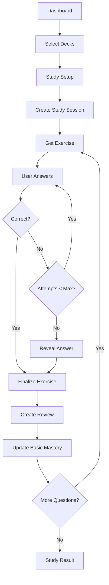
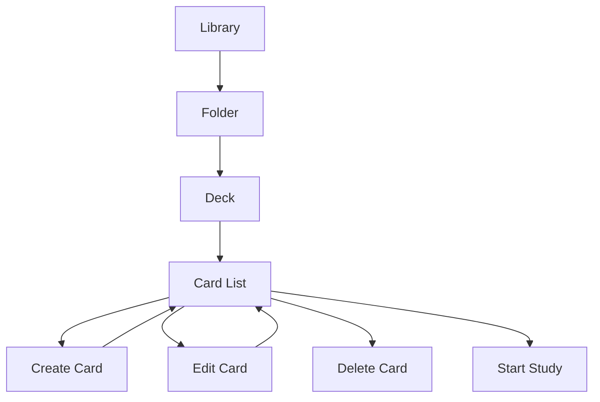
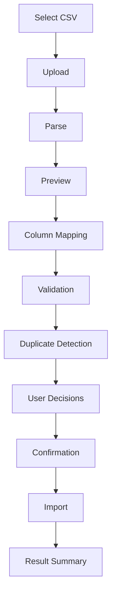
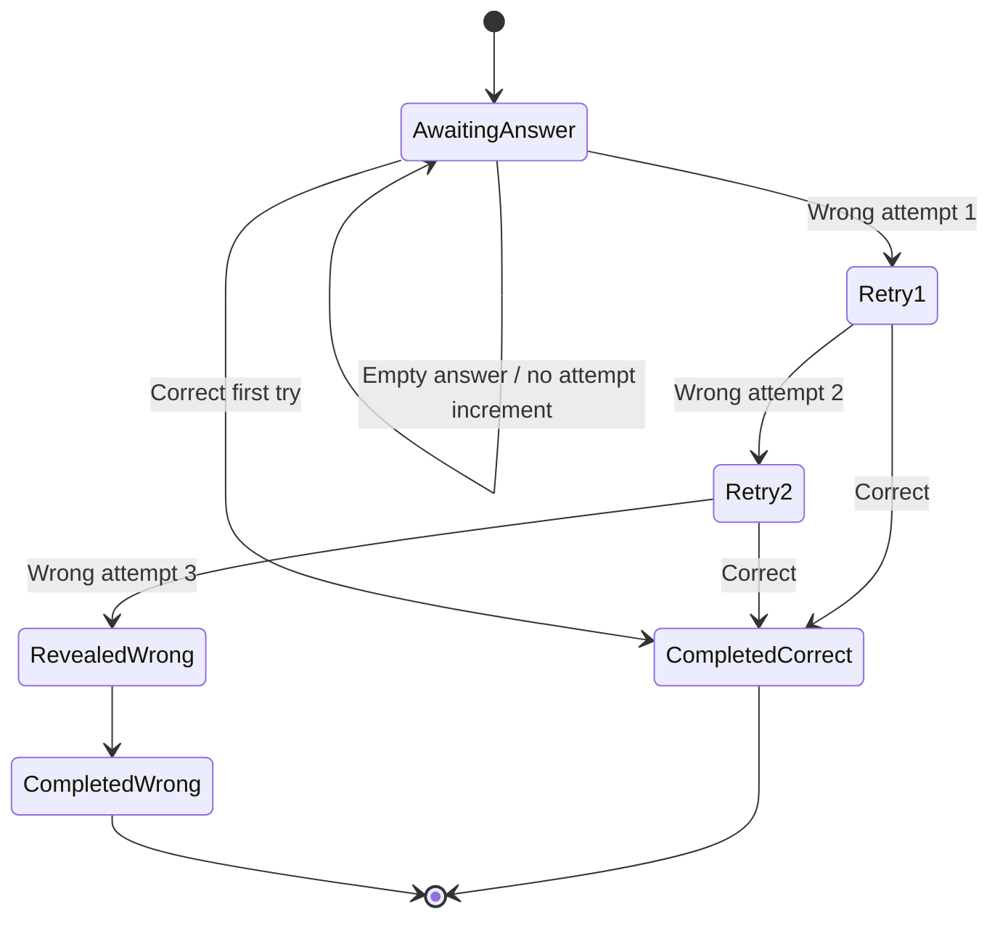

# UX & Product Design Specification

## 1. Mục tiêu

Biến requirements thành:
- user flows,
- screen structure,
- wireframe requirements,
- prototype scope,
- design review có evidence.

Thiết kế phải phục vụ Core Learning Loop và không tối ưu visual polish trước khi flow đúng.

---

# 2. Information Architecture

## Main Areas

```text
Authentication
├── Login
└── Register

App
├── Dashboard
├── Library
│   ├── Folder
│   ├── Deck
│   └── Card Editor
├── Import
├── Study
│   ├── Setup
│   ├── Session
│   └── Result
├── Progress
├── Search
└── Settings
```

## Proposed Routes

```text
/auth/login
/auth/register

/dashboard

/library
/folders/[folderId]
/decks/[deckId]
/cards/[cardId]
/cards/create

/import

/study/setup
/study/session/[sessionId]
/study/result/[sessionId]

/progress
/search
/settings
```

Routes cho Audio/Kanji/Offline không cần triển khai trong MVP nếu feature chưa active.

---

# 3. Core User Flow



---

# 4. Library Flow



### UX Requirements

- Empty Folder/Deck phải có empty state.
- Delete phải có confirmation nếu destructive.
- Loading/error state phải rõ.
- Bulk actions chỉ xuất hiện khi có selection.
- Mobile không phụ thuộc hover.
- Web có thể dùng split panel nếu không làm thay đổi business behavior.

---

# 5. Create/Edit Card Flow

```text
Choose Card Type
      ↓
Render Type-specific Form
      ↓
Validate Client-side
      ↓
Submit
      ↓
Backend Validation
      ↓
Success → Card Detail/List
Error   → Map field/general error
```

### Vocabulary MVP fields

- Japanese.
- Reading.
- Meaning.
- Sino-Vietnamese optional.
- Word Type optional.
- JLPT optional.
- Notes optional.
- Accepted Answers.
- Tags.

### Sentence MVP fields

- Japanese.
- Reading optional.
- Meaning.
- Notes optional.
- Accepted Meanings.

### Grammar MVP fields

- Pattern.
- Meaning.
- Structure optional.
- Explanation optional.
- Notes optional.

---

# 6. Import Flow



### Important UX States

- File rejected.
- Parse error.
- Empty file.
- Missing required mapping.
- Invalid row.
- Duplicate row.
- Partial row selection.
- Import success.
- Import failed before commit.

Không được import thật trước bước confirmation.

---

# 7. Study Setup Screen

## Required Controls

- Deck selection.
- Number of questions.
- Exercise types:
  - Flashcard.
  - Typing.
  - Multiple Choice.
- Shuffle.
- Max Attempts (default 3 nếu expose trong UI).

## Validation

- Phải có ít nhất một Deck.
- Phải có ít nhất một Exercise Type.
- Number of questions phải hợp lệ.
- Nếu không có eligible cards, phải thông báo trước khi vào session.

---

# 8. Exercise UI

## Shared Structure

```text
Progress
Question / Prompt
Answer Area
Primary Action
Feedback Area
Optional Card Context after completion
```

## Flashcard

```text
Front
↓
Reveal
↓
Forgot / Hard / Remember / Easy
```

> OD-008 trong [PROJECT_PLAN.md](../PROJECT_PLAN.md): 4-level self-rating và mapping sang Review/Basic Mastery phải được duyệt trước khi code Flashcard. Ví dụ này chưa chốt mapping.

## Typing

- Input.
- Submit.
- Wrong feedback.
- Attempt counter.
- Correct/reveal state.

## Multiple Choice

- Question.
- 4 lựa chọn hoặc số lượng được quyết định.
- Submit/selection state.
- Feedback.

---

# 9. Three-Attempt Interaction



### UX Rules

- Không reveal answer ở lần sai 1/2.
- Phân biệt "đúng ngay" với "đúng sau retry".
- Sau final result mới hiển thị full card context nếu phù hợp.
- Empty answer phải có validation feedback nhưng không tăng attempt.

---

# 10. Result Screen

Hiển thị ít nhất:

- total questions,
- correct,
- wrong,
- accuracy,
- first-try correct count,
- difficult cards count nếu có,
- duration nếu được đo.

Actions:
- Review mistakes.
- Study again.
- Back to Dashboard.

---

# 11. Wireframe Deliverables

Không cần tạo hàng chục file wireframe trong repo. Có thể giữ một link Figma và checklist trong file này.

## MVP Wireframes Required

- Login.
- Register.
- Dashboard.
- Library.
- Folder.
- Deck.
- Card Editor.
- Import.
- Study Setup.
- Flashcard.
- Typing.
- Multiple Choice.
- Study Result.
- Progress.
- Settings.

## Figma Link

```text
[TO_BE_ADDED]
```

## Wireframe Review Status

| Screen | Wireframe | Reviewed | Notes |
|---|---:|---:|---|
| Login | ☐ | ☐ | |
| Register | ☐ | ☐ | |
| Dashboard | ☐ | ☐ | |
| Library | ☐ | ☐ | |
| Deck | ☐ | ☐ | |
| Card Editor | ☐ | ☐ | |
| Import | ☐ | ☐ | |
| Study Setup | ☐ | ☐ | |
| Typing | ☐ | ☐ | |
| Multiple Choice | ☐ | ☐ | |
| Result | ☐ | ☐ | |
| Progress | ☐ | ☐ | |

---

# 12. Prototype Scope

Prototype phải kiểm chứng ít nhất hai journey:

## Journey A — Content Creation

```text
Login
→ Library
→ Create Folder
→ Create Deck
→ Create Vocabulary Card
```

## Journey B — Learning

```text
Dashboard/Deck
→ Study Setup
→ Typing Exercise
→ Wrong
→ Retry
→ Correct
→ Next
→ Result
```

## Journey C — Import

```text
Import
→ Upload CSV
→ Mapping
→ Duplicate Decision
→ Confirmation
→ Result
```

Prototype chưa cần backend thật nếu mục tiêu chỉ validate UX, nhưng state phải đủ để review flow.

---

# 13. Responsive Rules

## Desktop Web

Có thể dùng:

```text
Sidebar | Main Content | Optional Detail Panel
```

## Mobile

Ưu tiên:

```text
Header
Main Content
Bottom Navigation
```

### Rule

- Business flow giống nhau.
- Layout không bắt buộc giống 100%.
- Không tạo feature chỉ có Web nếu requirement không nói vậy.
- Touch target phải đủ lớn.
- Keyboard interaction trên Web phải hợp lý.
- Form dài trên mobile cần scroll và error focus.

---

# 14. AI Design Review Checklist

Mỗi review phải ghi:

```text
Finding
Evidence
Impact
Priority
Recommended Action
Assumption
Human Decision
```

## Goal Alignment
- [ ] Màn hình có phục vụ user goal chính?
- [ ] Có CTA cạnh tranh nhau không?
- [ ] Có step không cần thiết không?

## Clarity
- [ ] Label rõ nghĩa?
- [ ] Empty/loading/error state rõ?
- [ ] Feedback sau action rõ?

## Hierarchy
- [ ] Primary action nổi bật?
- [ ] Secondary action không lấn át?
- [ ] Content grouping dễ scan?

## Consistency
- [ ] Naming nhất quán?
- [ ] Button behavior nhất quán?
- [ ] Form validation nhất quán?

## Accessibility
- [ ] Không dùng màu là tín hiệu duy nhất?
- [ ] Text đủ đọc?
- [ ] Focus/keyboard hợp lý trên Web?
- [ ] Interactive control có accessible label?

## States
- [ ] Loading.
- [ ] Empty.
- [ ] Error.
- [ ] Disabled.
- [ ] Success.
- [ ] Retry.
- [ ] Unauthorized/expired session nếu liên quan.

---

# 15. Design Handoff Definition

Một screen sẵn sàng cho implementation khi:

- Có Requirement/User Story liên quan.
- Flow đã rõ.
- Wireframe/prototype đã review.
- Loading/empty/error states được định nghĩa.
- Validation behavior được ghi.
- API dependency được xác định.
- Mobile/Web differences được ghi nếu có.
- Accessibility issues chính đã review.

## 16. Authentication decision gate

OD-001 quyết định vòng đời session và trải nghiệm khi token hết hạn/bị thu hồi; OD-011 quyết định có tự đăng nhập sau đăng ký hay chuyển sang Login. Cả hai đang chờ phê duyệt trong [PROJECT_PLAN.md](../PROJECT_PLAN.md). Không suy ra các hành vi này từ route list hoặc mockup; wireframe và hướng visual lớn vẫn cần human selection theo AGENTS §10 trước implementation.
